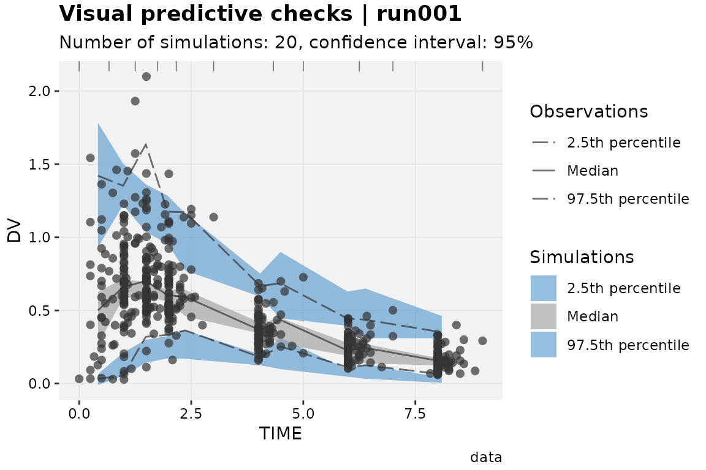

```{r setup, include=FALSE}
knitr::opts_chunk$set(echo = FALSE)
library(rxode2)
library(shiny)
library(ggplot2)
library(plotly)
library(dplyr)
library(forcats)
library(waiter)
library(mrgsolve)
library(tidyverse)
```
<style>
div.footnotes {
  position: absolute;
  bottom: 0;
  margin-bottom: 10px;
  width: 80%;
  font-size: 0.6em;
}
</style>

<script src="https://ajax.googleapis.com/ajax/libs/jquery/3.1.1/jquery.min.js"></script>
<script>
$(document).ready(function() {
  $('slide:not(.backdrop):not(.title-slide)').append('<div class=\"footnotes\">');

  $('footnote').each(function(index) {
    var text  = $(this).html();
    var fnNum = (index+1).toString();
    $(this).html(fnNum.sup());

    var footnote   = fnNum + '. ' + text + '<br/>';
    var oldContent = $(this).parents('slide').children('div.footnotes').html();
    var newContent = oldContent + footnote;
    $(this).parents('slide').children('div.footnotes').html(newContent);
  });
});
</script>

## About this deck
Slides for a course about variability and uncertainty, given at KULeuven on 14-Nov-2025. Available on github at https://github.com/rfaelens/courses/

## About me

```{r out.width='30%', out.extra='style="float:right; padding:10px"'}

```

* Ruben Faelens
  * Belgian, living in Leuven
  * ruben.faelens@gmail.com

* Computer Scientist, graduated 2010
* PK/PD modeling & simulation from 2012 onward
* Wrote _simulo_, a clinical trial simulation software
* Consultant for pharma industry from 2014 - 2018
* PhD in precision dosing from 2017 - 2022
* Working at J&J since Feb 2022

## Conflict of interest
The views and opinions expressed in this course are those of the speakers and do not necessarily reflect the views or positions of their employers.

The lecturer declares no conflict of interest.

## Learning objectives
* Understand the role of variability and uncertainty in pharmacomtric modeling & simulation

## References
* Meeker et al, Statistical intervals: a guide for practitioners and researchers. 2017
* Kummel et al, Confidence and prediction intervals for pharmacometric models. CPT: PSP, 2018
* Chuanpu, Variability and uncertainty: interpretation and usage of pharmacometric simulations and intervals. Journal of Pharmacokinetics and pharmacodynamics, 2022

## Contents
* Theoretical introduction
* Case 1: Concentration-QT
* Case 2: inhibition of a receptor
* Case 3: bio-equivalence
* Permissible shortcuts

## Theoretical introduction: a population
* A *population* is the entire group of individuals, objects, or elements that a researcher is interested in studying.
* *Variability* tells you how far apart data points lie from each other and from the center of a distribution in the population.
* A *sample* is a (representative) subset of the population.
* An *estimand* is the population measure we are interested in describing (e.g. population mean).

----

* *Uncertainty* is how far we can expect an estimate to be from the truth, based on a sample from the population.
* More observed data reduces uncertainty, but not variability.
* With limited sample size, variability drives uncertainty.
* A *95% confidence interval* covers the true value of the parameter 95% of the time (i.e. in many repeats of the same experiment)
 * This reflects uncertainty
* A *95% prediction interval* covers *future observations sampled from the population* 95% of the time
 * This reflects uncertainty and variability

## Pragmatic definitions
* A clinical trial is a sample of the population and is used to build a model describing the compound and disease (PK/PD)

* The model is used to infer on the *overall population*
 * Decisions: Dose, dose adaptation for intrinsic/extrinsic factors, target indication
 * Predictions include PK, PD, efficacy / responder rate, safety / AE rates

* The model is used to infer about *future clinical trials*
 * Decisions: Sample size, endpoint, inclusion / exclusion criteria
 * Predictions: study power, likely outcomes, detectable drug effect size

## Case study 1 | Concentration-QT

> The upper bound of the two-sided 90% confidence interval for model-derived ddQTc should be <10 ms at the highest clinically relevant exposure.
> `r tufte::quote_footer("ICH Guideline, The clinical evaluation of QT/QTc interval prolongation and proarrhythmic potential for non-antiarrhythmic drugs E14.")`

----

```{r message=FALSE}
## between 0.1 and 5
set.seed(1234)
data <- tibble(Conc=rep(c(0.1, 0.2, 0.5, 0.8, 1, 2, 3, 5), each=10) * exp(rnorm(80, sd=0.06)),
       dQT = 8*Conc + rnorm(80, mean=0, sd=15),
       Dose = rep(c(0.1, 0.2, 0.5, 0.8, 1, 2, 3, 5), each=10)*20
) %>% filter(Conc < 7)
ggplot(data, aes(x=Conc, y=dQT)) +
  geom_point(aes(color=factor(Dose))) +
  scale_x_log10(breaks=c(0.1, 0.3, 0.5, 0.8, 1, 3, 10)) +
  geom_smooth(method="lm") +
  labs(x="Concentration (ug/mL)", y="Model-adjusted dQTcF (msec)", color="Dose (mg)") +
  scale_y_continuous(breaks=seq(-30, 40, by=5)) +
  theme_bw() +
  coord_cartesian(ylim=c(-30, 40)) +
  geom_hline(yintercept=10, color='red') +
  labs(title="Conc-QT results for made-up-o-vir")
```

* What does the grey area show: 95% PI or 95% CI?
* Does this model fit the data?
* Is the model *fit for purpose*?
* Suppose the highest _made-up-o-vir_ concentration expected in Phase 2 is 0.3 ug/mL. Would you recommend expanded ECG monitoring?

## Case study 2 | Inhibition of a receptor
Our compound is designed to bind to a receptor, thereby inhibiting its function.

We have tested in vitro using cell cultures (N=3 per dose), measuring occupation using an immunofluorescent antibody that sticks to the receptor, as well as concentration within the cell. *What concentration target do you recommend to achieve 90% inhibition?*

```{r message=F}
set.seed(1234)
EMax <- 15
EC50 <- 1
Hill <- 0.8

N <- 3
data <- tibble(Conc=rep(c(0.01, 0.02, 0.05, 0.1, 0.2, 0.5, 1, 5), each=3) * exp(rnorm(8*N, sd=0.4)),
       Dose = rep(c(0.01, 0.2, 0.05, 0.1, 0.5, 1, 3, 5), each=3)*20,
       Eff = EMax * Conc**Hill / (EC50**Hill + Conc**Hill),
       Inhib = 1 / (1 + Eff) * (1+rnorm(8*N, sd=0.2))
)
ggplot(data, aes(x=Conc, y=Inhib)) +
  geom_point(aes(color=factor(Dose))) +
  scale_x_log10() +
  labs(x="Concentration (mg/L)", y="Inhibition (% of receptor)") +
  scale_y_continuous(labels=function(x){scales::percent(x-1)}, breaks=c(0, 0.1, 0.2, 0.3, 0.5, 0.7, 1)) +
  theme_bw()
```

## Case study 2 | Can we fit a model?
```{r message=F}

m1 <- nls(Inhib ~ 1 / (1 + EMax * Conc / (EC50 + Conc)), data=data, start=list(EMax=1, EC50=1))
summary(m1)

newdata = tibble(Conc = exp(seq(log(0.001), log(10), length.out=100)))

ggplot(data, aes(x=Conc, y=Inhib)) +
  geom_point(aes(color=factor(Dose))) +
  scale_x_log10(breaks=c(0.001, 0.01, 0.1, 1, 2, 5, 10)) +
  scale_y_continuous(labels=function(x){scales::percent(x-1)}, breaks=c(0, 0.1, 0.2, 0.3, 0.5, 0.7, 1)) +
  geom_line(data=broom::augment(m1, newdata=newdata),
            aes(y=.fitted)
              ) +
  coord_cartesian(xlim=c(0.01, 10)) +
  labs(x="Concentration (mg/L)", y="Inhibition (% of receptor)") +
  geom_hline(yintercept=0.1, color="red") + 
  theme_bw()
```

 *What concentration target do you recommend to achieve 90% inhibition?*
 
## Case study 2 | Never trust a single line...
```{r message=F}
y.conf <- propagate::predictNLS(m1, newdata=newdata, interval="confidence", alpha=0.05, nsim=10000)$summary
y.conf$Conc <- newdata$Conc

ggplot(data, aes(x=Conc, y=Inhib)) +
  geom_point(aes(color=factor(Dose))) +
  scale_x_log10(breaks=c(0.001, 0.01, 0.1, 1, 2, 5, 10)) +
  scale_y_continuous(labels=function(x){scales::percent(x-1)}, breaks=c(0, 0.1, 0.2, 0.3, 0.5, 0.7, 1)) +
  geom_line(data=broom::augment(m1, newdata=newdata),
            aes(y=.fitted)
              ) +
  geom_ribbon(data=y.conf, aes(ymin=`Sim.2.5%`, ymax=`Sim.97.5%`, y=Sim.Median), alpha=0.2) +
  coord_cartesian(xlim=c(0.01, 10)) +
  labs(x="Concentration (mg/L)", y="Inhibition (% of receptor)") +
  geom_hline(yintercept=0.1, color="red") + 
  theme_bw()
```

 *What concentration target do you recommend to achieve 90% inhibition?*


## Case study 3 | Bio-equivalence

> In studies to determine bioequivalence after a single dose, the parameters to be analysed are AUC(0-t) [..] and Cmax. For these parameters the 90% confidence interval for the ratio of the test and reference products should be contained within the acceptance interval of 80.00-125.00%.
> `r tufte::quote_footer("ICH Guideline on the investigation of bio-equivalence")`

----

Arm 1: Formulation A, 50mg single bolus, 12 healthy volunteers
Arm 2: Formulation B, 50mg single bolus, 12 healthy volunteers

PK samples at 0.5, 1, 2, 4, 6, 8, 12, and 24 hours post-dose.
LLOQ is 0.1 ng/mL.

```{r message=F}
library(mrgsolve)
mod <- mread("model.cpp")
N <- 12
regimen <- bind_rows(
  tibble(ID = seq_len(N), TIME=0, AMT=50, EVID=1, CMT=1, TMT="Formulation A"),
  tibble(ID = seq_len(N)+N, TIME=0, AMT=50, EVID=1, CMT=1, TMT="Formulation B")
)
tgrid <- c(0.5, 1, 2, 4, 6, 8, 12, 24)
set.seed(1234)
out <- mrgsim_df(mod, data=regimen, tgrid=tgrid,
                 Request="CP", recover="TMT")
out$CP[out$CP < 0.1] <- NA
ggplot(out, aes(x=TIME, y=CP, color=TMT)) +
  #geom_line(aes(group=ID)) +
  stat_summary(fun.data=mean_se) +
  stat_summary(geom="line", fun.data=mean_se) +
  scale_y_log10() +
  labs(x="Time after dose (h)", y="Concentration (ng/mL)", color="") +
  theme_bw()
```

----
```{r message=F}
library(PKNCA)
conc_obj <- PKNCAconc(out, CP~TIME | ID)
ncaOut <- pk.nca(PKNCAdata(conc_obj, intervals=data.frame(start=0, end=24, aucall=TRUE)),
                 verbose=TRUE) %>% as.data.frame()
ncaResults <- out %>% filter(TIME == 0.5) %>%
  left_join(ncaOut %>% select(ID, PPORRES)) %>%
  rename(Cmax=CP, AUC=PPORRES) %>%
  select(TMT, ID, Cmax, AUC)

ncaResults %>% tidyr::pivot_longer(cols=c(Cmax, AUC)) %>%
ggplot(aes(x=TMT, y=value, color=TMT)) +
  geom_boxplot() +
  facet_grid(name~., scales="free") +
  theme_bw() +
  scale_y_log10() +
  labs(x="") +
  scale_color_discrete(guide=F)
```

```{r}
test1 <- t.test(log(ncaResults$Cmax[1:12]), log(ncaResults$Cmax[13:24]), conc.level=0.9) %>%
  broom::tidy() %>% mutate(name="Cmax")
test2 <- t.test(log(ncaResults$AUC[1:12]), log(ncaResults$AUC[13:24]), conc.level=0.9) %>%
  broom::tidy() %>% mutate(name="AUC")
bind_rows(test1, test2) %>%
  ggplot(aes(x=name)) + 
  geom_hline(yintercept=c(0.8, 1.25), linetype=2) +
  geom_pointrange(aes(ymin=exp(conf.low), y=exp(estimate), ymax=exp(conf.high))) +
  labs(x="", y="GMR")
```

## Case study 3b | design of bio-equivalence trial

```{r cache=TRUE}
N <- 2000
regimen <- bind_rows(
  tibble(ID = seq_len(N), TIME=0, AMT=50, EVID=1, CMT=1)
)
tgrid <- c(0.5, 1, 2, 4, 6, 8, 12, 24)
set.seed(1234)
out <- mrgsim_df(mod, data=regimen, tgrid=tgrid, Request="CP")
out$CP[out$CP < 0.1] <- NA
conc_obj <- PKNCAconc(out, CP~TIME | ID)
ncaOut <- pk.nca(PKNCAdata(conc_obj, intervals=data.frame(start=0, end=24, aucall=TRUE)),
                 verbose=F) %>% as.data.frame()
ncaResults <- out %>% filter(TIME == 0.5) %>%
  left_join(ncaOut %>% select(ID, PPORRES)) %>%
  rename(Cmax=CP, AUC=PPORRES) %>%
  select(ID, Cmax, AUC)


testTrial <- function(N) {
  Cmax1 <- sample(ncaResults$Cmax, size=N)
  Cmax2 <- sample(ncaResults$Cmax, size=N)
  AUC1 <- sample(ncaResults$AUC, size=N)
  AUC2 <- sample(ncaResults$AUC, size=N)
  
  test1 <- t.test(log(Cmax1), log(Cmax2), conc.level=0.9) %>% broom::tidy() %>% mutate(name="Cmax")
  test2 <- t.test(log(AUC1), log(AUC2), conc.level=0.9) %>% broom::tidy() %>% mutate(name="AUC")
  bind_rows(test1, test2)
}

Ntrial <- 1000
ctsResults <- purrr::map_dfr(seq(10, 200, by=10), function(N){
  out <- purrr::map_dfr(seq_len(Ntrial), ~testTrial(N))
  out$i <- rep(seq_len(Ntrial), each=2)
  out$N <- N
  out
}, .progress="text")
ctsResults2 <- ctsResults %>%
  mutate(SUCCESS = exp(conf.low) >= 0.80 & exp(conf.high) <= 1.25)

PoSS <- bind_rows(
  ctsResults2 %>% group_by(N, name) %>%
    summarize(PoSS = mean(SUCCESS)),
  ctsResults2 %>% 
    group_by(N, i) %>% summarize(SUCCESS = all(SUCCESS)) %>%
    group_by(N) %>% summarize(PoSS = mean(SUCCESS)) %>%
    mutate(name="Combined")
)

ggplot(PoSS, aes(x=N, y=PoSS)) +
  geom_line() +
  geom_point() +
  facet_wrap(~name) +
  scale_y_continuous(labels=scales::percent) +
  geom_hline(yintercept=0.80) +
  theme_bw()
```

## Case study 3b | Sampling variability?

```{r}
PoSS2 <- PoSS %>% group_by(N, name) %>%
  group_modify(function(data,keys){
    x <- Ntrial * data$PoSS
    n <- Ntrial
    binom.test(x, n, p=0.5, conf.level=0.95) %>% broom::tidy()
  }, .keep=TRUE)

ggplot(PoSS2, aes(x=N, y=estimate)) +
  geom_line() +
  geom_ribbon(aes(ymin=conf.low, ymax=conf.high), alpha=0.2) +
  geom_point() +
  facet_wrap(~name) +
  scale_y_continuous(labels=scales::percent) +
  geom_hline(yintercept=0.80) +
  theme_bw()
```

* Simulation appropriateness metric.
* Shows uncertainty in your simulated summary statistic. *This approaches 0 as you simulate infinite samples*.

## Case study 3b | what about uncertainty?
The bio-availability of our new formulation may be 5% lower as compared to the originator. This may result in higher or lower concentrations. How does this uncertainty affect our power and required sample size??

```{r cache=TRUE}
testTrial2 <- function(N, MOD=1) {
  Cmax1 <- sample(ncaResults$Cmax, size=N)
  Cmax2 <- sample(ncaResults$Cmax, size=N) * MOD
  AUC1 <- sample(ncaResults$AUC, size=N)
  AUC2 <- sample(ncaResults$AUC, size=N) * MOD
  
  test1 <- t.test(log(Cmax1), log(Cmax2), conc.level=0.9) %>% broom::tidy() %>% mutate(name="Cmax")
  test2 <- t.test(log(AUC1), log(AUC2), conc.level=0.9) %>% broom::tidy() %>% mutate(name="AUC")
  bind_rows(test1, test2)
}

Ntrial <- 1000
ctsResultsMod <- purrr::map_dfr(seq(10, 200, by=10), function(N){
  out <- purrr::map_dfr(seq_len(Ntrial), ~testTrial2(N, MOD=0.95))
  out$i <- rep(seq_len(Ntrial), each=2)
  out$N <- N
  out
}, .progress="text")
ctsResultsMod2 <- ctsResultsMod %>%
  mutate(SUCCESS = exp(conf.low) >= 0.80 & exp(conf.high) <= 1.25)

PoSSMod <- bind_rows(
  ctsResultsMod2 %>% group_by(N, name) %>%
    summarize(PoSS = mean(SUCCESS)),
  ctsResultsMod2 %>% 
    group_by(N, i) %>% summarize(SUCCESS = all(SUCCESS)) %>%
    group_by(N) %>% summarize(PoSS = mean(SUCCESS)) %>%
    mutate(name="Combined")
)


ggplot(PoSS, aes(x=N, y=PoSS)) +
  geom_line() +
  geom_point() +
  geom_line(data=PoSSMod, color='red') +
  geom_point(data=PoSSMod, color='red') +
  facet_wrap(~name) +
  scale_y_continuous(labels=scales::percent) +
  geom_hline(yintercept=0.80) +
  annotate("text", color='red', label='F=95%', x=100, y=0) +
  annotate("text", label='F=100%', x=50, y=0.4) +
  theme_bw()

```

# Allowable shortcuts in pharmacometric simulation
* PK generally well described by end of Ph1. RSEs low. Largest driver for 95% PI is _variability_. Parameter uncertainty may be ignored, except for rare covariate effects.
* PD well described by end of Ph2. Largest driver for 95% PI is still _variability_. Parameter uncertainty may be ignored.
* ER typically describes population summary statistics only (e.g. response rate). 95% PI is primarily determined by _uncertainty on parameter estimates_.

* Disregard uncertainty when variability is 1) well characterized, and 2) variability is much larger than uncertainty

# What intervals are shown on a VPC?


* Q: How are variability and uncertainty represented on a VPC?
* A: *Only variability is presented!*
* The area is a specific interval without statistical properties. We call it a *degenerate VPC interval* or simply *VPC interval*.
* *Wrong: * 95% PI (lines) and associated 95% CI (area).
** Statisticians will roll their eyes at you...
* Better: 5th, 50th and 95th population quantiles (lines), with associated 95% VPC intervals (area)

# Conclusion
- Variability and uncertainty are important concepts in pharmacometrics
- Incorporate these concepts in all decision making
- You may be able to simplify where appropriate.
- You can use the term 95% PI.